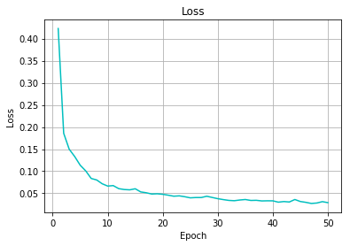
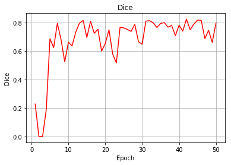

# Implementation of 3D-UNet by pytorch
This is a 3D segmentation framework of UNet for medical volume by pytorch   
The network is inspired by [U-Net: Convolutional Networks for Biomedical Image Segmentation](https://lmb.informatik.uni-freiburg.de/people/ronneber/u-net/) and [3D U-Net: Learning Dense Volumetric Segmentation from Sparse Annotation](https://arxiv.org/pdf/1606.06650.pdf)
  
## How to use:  

**Dependencies**  
This work depends on the following libraries:  
Pytorch == 0.4.0  
Python == 3.6  

**Train**  
You can run the main.py to train the network and validate.

## Result
In my task (prostate segmentation in transrectal ultrasound, the input size is 224X225X175), I achieved a dice of 0.8 and 0.2946s per volume process speed.  
The Dice and Loss details is as follow:  
  
  

## Model Detail  
The 3D UNet details is as follow:  
(To be easy observed, the input size is 224X224X224)

---
        Layer (type)               Output Shape         Param 
---
            Conv3d-1    [-1, 16, 112, 112, 112]             448  
       BatchNorm3d-2    [-1, 16, 112, 112, 112]              32  
              ReLU-3    [-1, 16, 112, 112, 112]               0  
            Conv3d-4    [-1, 16, 112, 112, 112]           6,928  
       BatchNorm3d-5    [-1, 16, 112, 112, 112]              32  
              ReLU-6    [-1, 16, 112, 112, 112]               0  
         MaxPool3d-7       [-1, 16, 56, 56, 56]               0  
            Conv3d-8       [-1, 32, 56, 56, 56]          13,856  
       BatchNorm3d-9       [-1, 32, 56, 56, 56]              64  
             ReLU-10       [-1, 32, 56, 56, 56]               0  
           Conv3d-11       [-1, 32, 56, 56, 56]          27,680  
      BatchNorm3d-12       [-1, 32, 56, 56, 56]              64  
             ReLU-13       [-1, 32, 56, 56, 56]               0  
        MaxPool3d-14       [-1, 32, 28, 28, 28]               0  
           Conv3d-15       [-1, 64, 28, 28, 28]          55,360  
      BatchNorm3d-16       [-1, 64, 28, 28, 28]             128  
             ReLU-17       [-1, 64, 28, 28, 28]               0  
           Conv3d-18       [-1, 64, 28, 28, 28]         110,656  
      BatchNorm3d-19       [-1, 64, 28, 28, 28]             128  
             ReLU-20       [-1, 64, 28, 28, 28]               0  
        MaxPool3d-21       [-1, 64, 14, 14, 14]               0  
           Conv3d-22      [-1, 128, 14, 14, 14]         221,312  
      BatchNorm3d-23      [-1, 128, 14, 14, 14]             256  
             ReLU-24      [-1, 128, 14, 14, 14]               0  
           Conv3d-25      [-1, 128, 14, 14, 14]         442,496  
      BatchNorm3d-26      [-1, 128, 14, 14, 14]             256  
             ReLU-27      [-1, 128, 14, 14, 14]               0  
        MaxPool3d-28         [-1, 128, 7, 7, 7]               0  
           Conv3d-29         [-1, 128, 7, 7, 7]         442,496  
      BatchNorm3d-30         [-1, 128, 7, 7, 7]             256  
             ReLU-31         [-1, 128, 7, 7, 7]               0  
           Conv3d-32         [-1, 128, 7, 7, 7]         442,496  
      BatchNorm3d-33         [-1, 128, 7, 7, 7]             256  
             ReLU-34         [-1, 128, 7, 7, 7]               0  
           Conv3d-35       [-1, 64, 14, 14, 14]         442,432  
      BatchNorm3d-36       [-1, 64, 14, 14, 14]             128  
             ReLU-37       [-1, 64, 14, 14, 14]               0  
           Conv3d-38       [-1, 64, 14, 14, 14]         110,656  
      BatchNorm3d-39       [-1, 64, 14, 14, 14]             128  
             ReLU-40       [-1, 64, 14, 14, 14]               0  
           Conv3d-41       [-1, 32, 28, 28, 28]         110,624  
      BatchNorm3d-42       [-1, 32, 28, 28, 28]              64  
             ReLU-43       [-1, 32, 28, 28, 28]               0  
           Conv3d-44       [-1, 32, 28, 28, 28]          27,680  
      BatchNorm3d-45       [-1, 32, 28, 28, 28]              64  
             ReLU-46       [-1, 32, 28, 28, 28]               0  
           Conv3d-47       [-1, 16, 56, 56, 56]          27,664  
      BatchNorm3d-48       [-1, 16, 56, 56, 56]              32  
             ReLU-49       [-1, 16, 56, 56, 56]               0  
           Conv3d-50       [-1, 16, 56, 56, 56]           6,928  
      BatchNorm3d-51       [-1, 16, 56, 56, 56]              32  
             ReLU-52       [-1, 16, 56, 56, 56]               0  
           Conv3d-53    [-1, 16, 112, 112, 112]          13,840  
      BatchNorm3d-54    [-1, 16, 112, 112, 112]              32  
             ReLU-55    [-1, 16, 112, 112, 112]               0  
           Conv3d-56    [-1, 16, 112, 112, 112]           6,928  
      BatchNorm3d-57    [-1, 16, 112, 112, 112]              32  
             ReLU-58    [-1, 16, 112, 112, 112]               0  
           Conv3d-59     [-1, 1, 112, 112, 112]              17  
---  
Total params: 2,512,481  
Trainable params: 2,512,481  
Non-trainable params: 0  

---

Input size (MB): 5.36  
Forward/backward pass size (MB): 2605.66  
Params size (MB): 9.58  
Estimated Total Size (MB): 2620.60 
